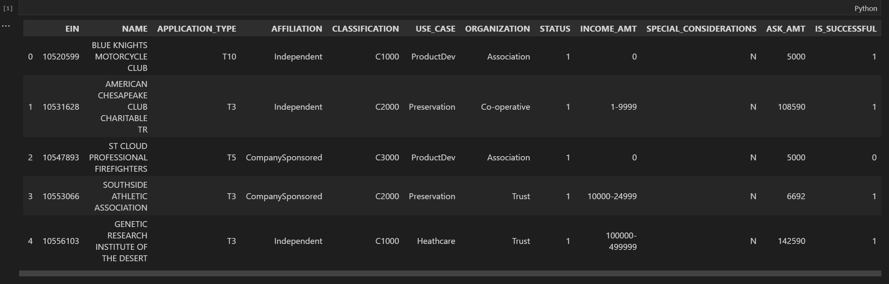
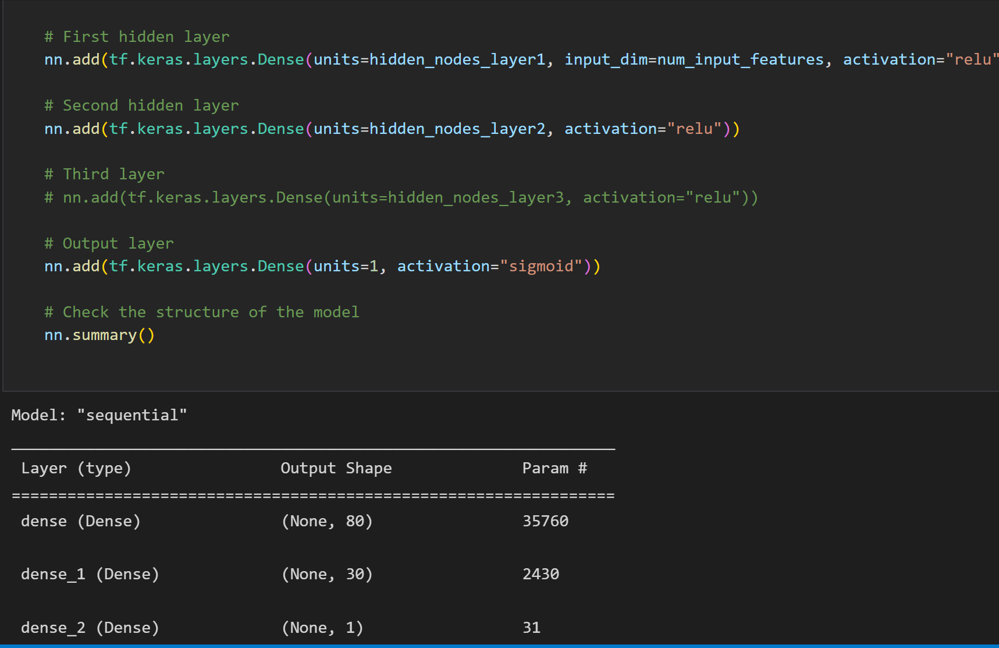
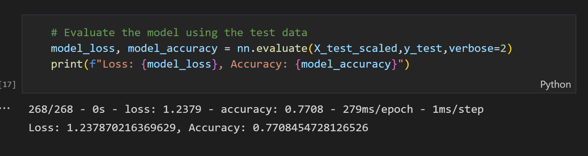

# Neural_Network_Charity_Analysis

## Overview

The purpose of this project is to use a neural network model to classify whether charity projects will succeed or fail.

## Results

### Preprocessing

- The target is the `IS_SUCCESSFUL` column.
- Every column other than the `IS_SUCCESSFUL` column and dropped columns is a feature.
- Since the `EIN` column does not provide any information, it should be dropped. However keeping and binning the `NAME` column retains information about the project success rate of specific organizations.

### Model

- The model uses two ReLU layers, the first with 80 neurons and the second with 30 neurons, and one sigmoid output layer with 20 neurons. Experimenting with adding more layers did not significantly improve model accuracy, so adding more layers would have only increased computational expense.
- Performance targets were met, with an accuracy of 0.77.
- Thanks to help from other peope in the course (after lots of experimentation), I was able to meet performance targets by retaining the `NAME` column and binning it with a count threshold of 5.

## Summary

Overall, the deep learning model performed well, with an accuracy of 0.77. However, given the shape of the data and the information condensed by binning, a random forest or some other ensemble learning method might have the potential to improve model accuracy or achieve similar accuracy. Hence, it would be a good idea to check the performance of a simple random forest model on the preprocessed data and then see whether further preprocessing or model tuning can improve the model's accuracy.
